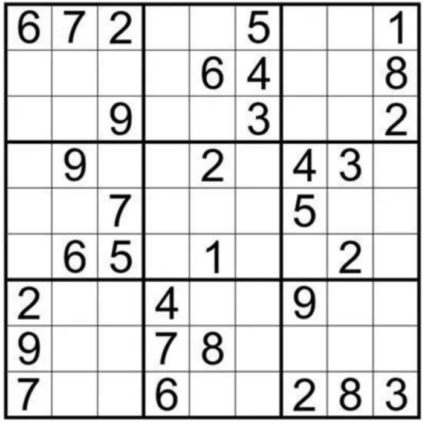

# 需求分析2.0

### 1. 背景：

jason哥最近迷上了九宫格数独，所谓九宫格数独是把一个9x9的网格从左到右从上到下依次划分出9个3x3的子网格，每个3x3的子网格称为一宫，共划分成9宫。而9宫数独是在网格的格子上填上1到9的数字，要求每一行每一列和每一宫都刚好填上1到9的数字不重复不遗漏，每一个九宫格数独如图所示：

 

对于聪明的jason哥来说，只做一个九宫格数独实在是太简单了，他可以同时完成9个九宫格的数独求解，但每次玩数独游戏时，每一个九宫格数独都是串行生成的，暴躁的jason哥不愿意等待串行生成的时间，于是需要你并发生成9个九宫格数独，注意本次作业只需要并发生成9个数独，而不是求解，但注意所生成数独的可解性，具体的求解交给聪明的jason哥就可以啦。

### 2. 项目概述

- **项目名称：** 数多窟（Sudoku）
- **项目类型：** 高级休闲游戏开发
- **项目范围：** 数多窟是一款高级数独游戏，旨在为用户提供有挑战的游戏和益智体验。游戏包括以下主要功能和特性：
  - **多线程9x9x9的多并发数独：** 同时挑战和解决多个数独，用户可以在一个游戏会话中锻炼解谜技能，提高反应速度和逻辑思维能力。
  - **高效率生成数独：** 系统需要实现高效的数独生成算法，以确保生成数独的过程尽可能快速，减少用户等待时间。
  - **清爽简约的用户界面**：PC端大屏应用，数独网格规整清晰不密集，减轻用户的视觉疲劳。
  - **不同难度级别的数独谜题：** 包括“新手”，“简单”，“中等”，“困难”，“地狱”
- **目标用户：** 本项目的目标用户是高级数独挑战者，他们不满足于一次玩一张数独，更希望能够一次性畅玩9个数独。此外，该游戏也适合其他数独爱好者和寻找益智游戏的用户。
- **业务需求：** 以下是项目的主要业务需求和其优先级：
  1. 多并发高级数独游戏，可以同时挑战解决多个九宫格数独 - 优先级：高
  2. 实现高效的数独生成算法，以确保生成数独的过程尽可能快速 - 优先级：高
  3. 提供清爽简约的用户界面，适应不同用户环境和喜好 - 优先级：高
  4. 提供多个数独谜题难度级别（初级、中级、高级） - 优先级：中
  5. 实现成就系统，以鼓励用户挑战更高级别的数独 - 优先级：低
  6. 支持日间模式、护眼模式和夜间模式 - 优先级：低

### 3. 需求分析的NABCD模型

**Need（需求）：** 明确该产品的目标用户是谁，他们的需求是什么。

**Approach（做法）：** 在了解客户需求的基础上，确定应对方式。

**Benefit（好处）：** 明确该产品能给用户带来哪些益处。

**Competition（竞争）：** 分析与该产品相竞争的其他产品或服务，找出其优势和劣势。

**Delivery（推广）：** 在确定了该产品的需求、方法、益处和竞争优势后，考虑如何将其交付给目标用户。

#### Need（需求）：

1. **并发生成数独** ：系统能够同时生成9个九宫格数独，以满足用户同时挑战多个数独的需求，提高游戏难度和效率。

2. **保证数独可解性** ：系统确保生成的每个九宫格数独都可解，以保证用户能够在后续游戏中解决这些数独，展示他们的解谜技能。

#### Approach（做法）：

设计一个满足需求的数独生成的网页。

具体功能如下：

1. **数字选择：** 用户无需使用键盘输入，使用鼠标点选相应数字填入。

2. **难度设置：** 有1-5个难度可选，分别为“新手”，“简单”，“中等”，“困难”，“地狱”。

3. **并行生成独立数独页面：** 9个9宫格数独并行生成，每个数独都可独立求解，在界面上方标签栏以“puzzle1”~“puzzle9”的标签展现。

#### Benefit（好处）：

1. **数字选择：** 目光只需专注于屏幕，保证了游戏的沉浸感和便利性，使用直观便捷。

2. **难度设置：** 多种难度可选，适应不同水平的用户，满足玩家的挑战心理，符合成长曲线，延长产品生命周期，提高游戏的丰富度。
3. **界面设置：** 相比前后移动按钮等其他形式的UI设计：
   - 只需点选一次随时选择其中任意一个数独页面，操作便捷。
   - 为每个数独页面编码，方便用户切换查找。

#### Competition（竞争）：

|                  | 优势 (Strengths)                                             | 劣势 (Weaknesses)                          | 机会 (Opportunities)                                | 威胁 (Threats)                       |
| ---------------- | ------------------------------------------------------------ | ------------------------------------------ | --------------------------------------------------- | ------------------------------------ |
| 数多窟           | - 并发生成多个数独 \- 直观的数字选择界面 \- 多个难度级别可选 - 适用于大屏幕设备 - 单机游戏无需互联网连接 | - 用户需要下载和安装 - UI界面不够清爽 | \- 推出新的数独挑战模式 - 断改进和优化用户体验 | \- 强大竞品的存在 \- 市场饱和度 |
| 移动端数独应用   | - 已有大用户基础 - 手机端利用碎片化休闲时间             | - 界面可能相对较小 - 广告多，沉浸感差 | - 持续改进应用                                      | - 竞争激烈                           |
| 在线数独网站     | - 免费在线访问 - 社区和讨论区                           | - 需要互联网连接 - 广告多，沉浸感差   | - 提供多样化的数独挑战                              | - 用户流失率可能较高                 |
| 桌面数独游戏应用 | - 适用于大屏幕设备 \- 单机游戏无需互联网连接            | - 受限于桌面平台                           | - 提供高质量的数独体验                              | - 用户流失率可能较高                 |

针对竞争，我们的优势在于**并发生成多个数独**，提供了更高的挑战性和娱乐性，以及**直观的UI界面**。此外，我们可以通过不断改进和优化用户体验来吸引更多用户。

#### Delivery（推广）：

推广策略包括以下方面：

1. **精准广告定位**：使用在线广告平台，如B站等，将广告针对那些对数独感兴趣的用户，并突出多并发生成的特点。选择在数独爱好者的社交群体中投放广告。
2. **社交媒体宣传**：在社交媒体平台上创建精彩的广告和宣传内容，强调“数多窟”可以同时生成多个数独，提供更高的挑战和娱乐性。使用视觉效果来演示并发生成的过程。
3. **教程和演示视频**：制作教程和演示视频，展示“数多窟”如何同时生成多个数独，以及用户如何使用这个功能。将视频分享到B站、知乎、小红书等社交媒体上，并在应用内提供链接。